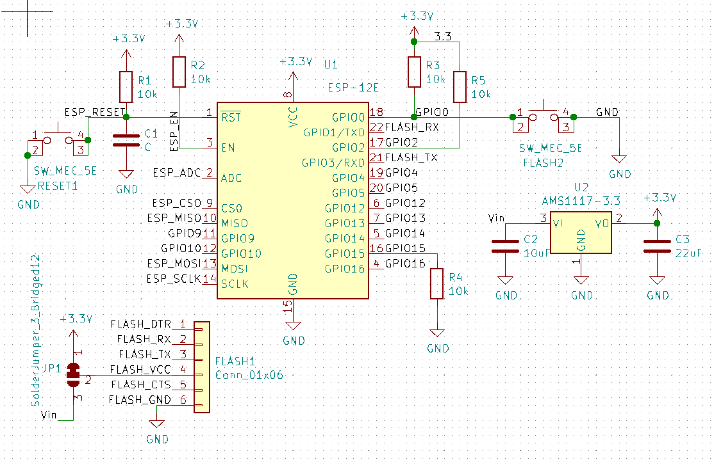
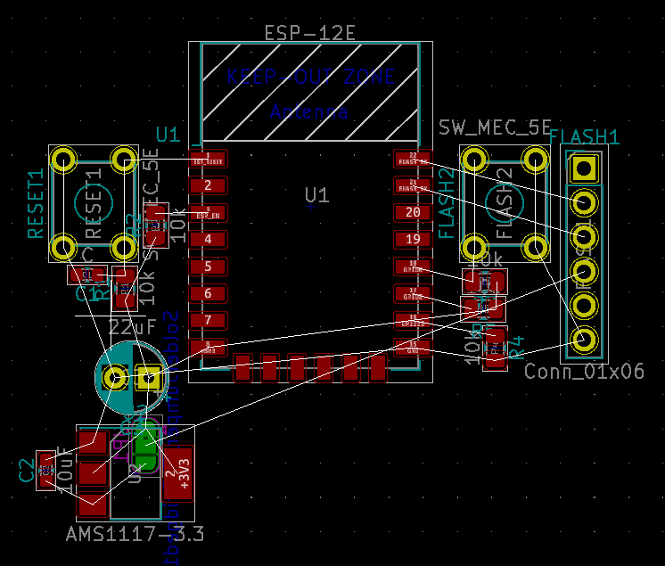

# About

This is a simple template for kicad to get started making ESP12-E based boards.

# Installation

Juste clone the repository in `$HOME/kicad/template/esp12E`:

```
git clone https://github.com/XavierTolza/Kicad-ESP12-E-template.git $HOME/kicad/template/esp12E
```

And start a new project from the template



